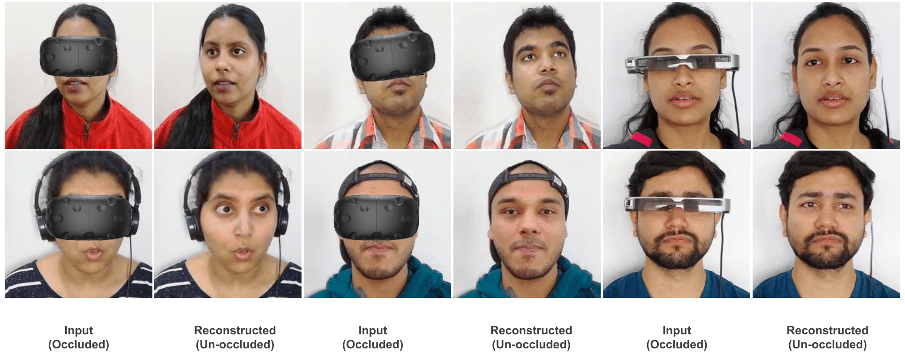

# Attention based Occlusion Removal for Hybrid Telepresence Systems
_Surabhi Gupta, Ashwath Shetty, Avinash Sharma_

## Abstract

Traditionally, video conferencing is a widely adopted solution for remote communication, but a lack of immersiveness comes inherently due to the 2D nature of facial representation. The integration of Virtual Reality (VR) in a communication/telepresence system through Head Mounted Displays (HMDs) promises to provide users a much better immersive experience. However, HMDs cause hindrance by blocking the facial appearance and expressions of the user. We propose a novel attention-enabled encoder-decoder architecture for HMD de-occlusion to overcome these issues. We also propose to train our person-specific model using short videos of the user, captured in varying appearances, and demonstrated generalization to unseen poses and appearances of the user. We report superior qualitative and quantitative results over state-of-the-art methods. We also present applications of this approach to hybrid video teleconferencing using existing animation and 3D face reconstruction pipelines.

## Results

## Results on Videos

## Downloads
* [Paper](https://ieeexplore.ieee.org/abstract/document/9866956/)
* [Supplementary]()
* Code coming soon !

## Contact
* [Surabhi Gupta](surabhi.gupta@research.iiit.ac.in)
* [Ashwath Shetty](ashwath.shetty@research.iiit.ac.in)
* [Avinash Sharma](asharma@iiit.ac.in)
